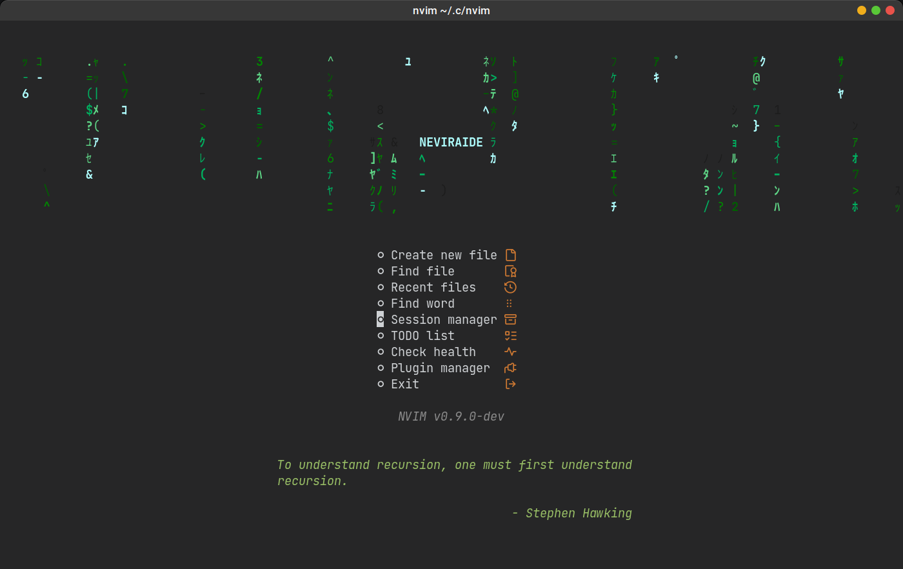
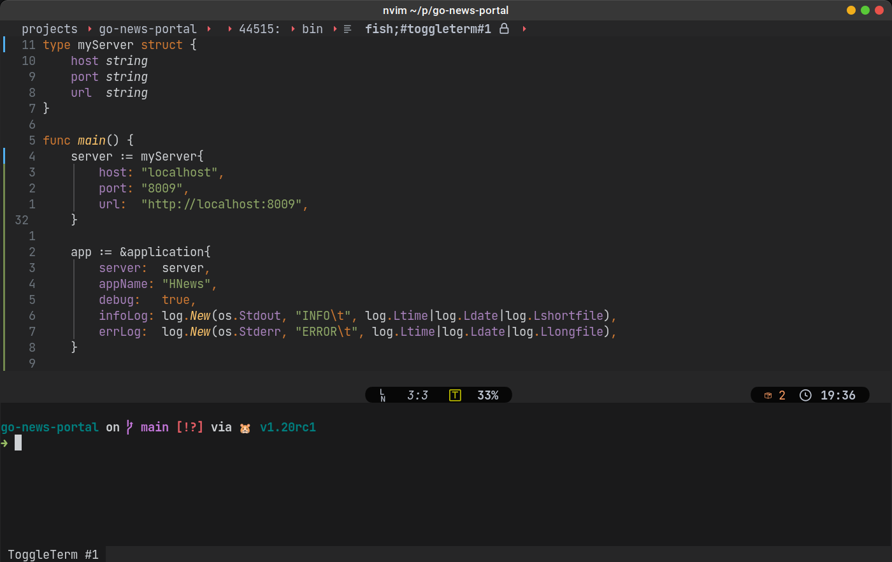
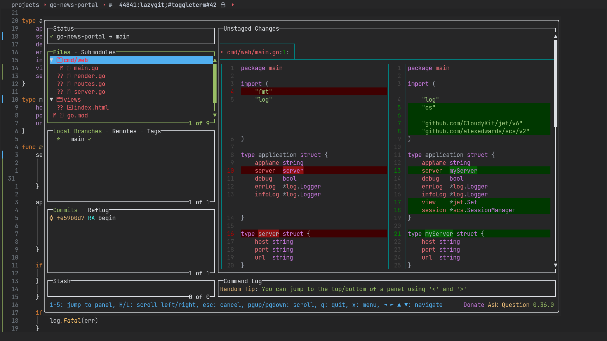

# NEVIRAIDE
Fast, comfortable and light GolangIDE
---

### This is my setup of NEOVIM
***Remember that it's only modifications of config files and collect of different plugins.
Vim/Neovim is a FREEDOM.
You can setup your own IDE or simple text redactor.
You need only define what you want and what you need.***

#### Content
- [Screenshots](#screenshots)
- [Dependencies](#dependecies)
- [Instalation](#installation)
  - [Auto](#auto)
  - [Manual](#manual)
- [Used plugins](#used-plugins)
___
## Screenshots
#### Customizable startup screen

___
#### Comfortable colors for long reading

___
#### Wokring in shell

___
#### All git actions with lazygit

___
## Dependencies

- fd *(search in filesystem)*
- ripgrep *(search in text)*
- npm *(install dependecies)*
- unzip *(install dependecies)*
- lazygit *(working with git)*
- nonicons *(font for icons)*
- delta *(pretty look git diff)*

## Installation
Make sure that all dependecies are installed.
###  Auto
To quick install my vision of neovim (calls NEVIRAIDE) you may download install script and rin it!

**[Install script](https://github.com/RAprogramm/NEVIRAIDE/blob/golangIDE/install.sh)** - to download it right click and "Save Link As..."

**! Make script executable !** *(to make script executable run* `sudo chmod +x install.sh` *in place where downloaded script is located)*

### Manual
1. Clone this repository.
3. Delete ~/.config/nvim (if exist)
2. Rename it (from "NEVIRAIDE" to "nvim").
4. Move our renamed folder to ~/.config 
___

### Used plugins

Core

- [Lazy]() - plugin manager
- [Plenary](https://github.com/nvim-lua/plenary.nvim) - plugin for async 
- [Telescope](https://github.com/nvim-telescope/telescope.nvim) - is very powerfull feature

UI

- [Lualine]() - status line, winbar and tabline
- [Devicons](https://github.com/nvim-tree/nvim-web-devicons) - icons
- [Nonicons]() - outlined icons
- [Indent-blankline](https://github.com/lukas-reineke/indent-blankline.nvim) - indent guides
- [Notify](https://github.com/rcarriga/nvim-notify) - notification manager
- [DAP-UI](https://github.com/rcarriga/nvim-dap-ui) - a UI for nvim-dap
- [DAP-ghosttext](https://github.com/rcarriga/nvim-dap-ui) - a ghost text for nvim-dap
- [NoICE]() - klsadflkahsdlk

Completions

- [cmp]()
- [Luasnip](https://github.com/L3MON4D3/LuaSnip)

