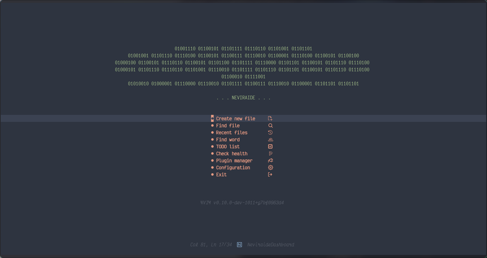

  <h1>🌟 NEVIRAIDE 🌟</h1>
    
For Linux

  
<strong>Crafting an IDE Oasis in Neovim</strong>

  
"Remember, Neovim is your canvas for shaping a personalized IDE or a serene text sanctuary. Your desires and needs steer the way."

  <h2>📜 CONTENTS 📜</h2>
  <ul style='list-style: none';>
    <li><a href='#dependencies'>Dependencies</a></li>
    <li><a href='#installation'>Installation</a></li>
    <li><a href='#plugins'>Used plugins</a></li>
    <li><a href='#donations'>Donations</a></li>
  </ul>

  <h2 id='dependencies'  style="text-align: center;">DEPENDENCIES</h2>
fd, rg

  <h2 id='installation'  style="text-align: center;">INSTALLATION</h2>

Replace your `~/.config/nvim` with this repository. Later i will make script for automatic installation.

  <h2 id='plugins'  style="text-align: center;">🛠️ USED PLUGINS 🛠️</h2>

UI and Interface:

<ul>
  <li>
    <a href="https://github.com/nvim-lua/plenary.nvim">nvim-lua/plenary.nvim</a>: A comprehensive Lua library for Neovim.
  </li>
  <li>
    <a href="https://github.com/MunifTanjim/nui.nvim">MunifTanjim/nui.nvim</a>: A UI library for Neovim.
  </li>
  <li>
    <a href="https://github.com/RAprogramm/neviraide-ui.nvim">neviraide-ui.nvim</a>: Elevating your interface experience.
  </li>
</ul>

Terminal and Kitty Integration:

<ul>
  <li>
    <a href="https://github.com/nvchad/nvterm">nvterm</a>: Seamlessly integrating the Neovim terminal.
  </li>
  <li>
    <a href="https://github.com/RAprogramm/nekifoch">Nekifoch</a>: Harmonizing font elegance through Kitty.
  </li>
</ul>

Icons and Visual Enhancements:

<ul>
  <li>
    <a href="https://github.com/nvim-tree/nvim-web-devicons">nvim-web-devicons</a>: Enhancing icon support for Neovim.
  </li>
  <li>
    <a href="https://github.com/rcarriga/nvim-notify">nvim-notify</a>: A notification plugin for Neovim.
  </li>
  <li>
    <a href="https://github.com/lukas-reineke/indent-blankline.nvim">indent-blankline.nvim</a>: Display indent guides in Neovim.
  </li>
</ul>

Completion and LSP:

<ul>
  <li>
    <a href="https://github.com/hrsh7th/nvim-cmp">nvim-cmp</a>: A fast completion plugin for Neovim.
  </li>
  <li>
    <a href="https://github.com/neovim/nvim-lspconfig">nvim-lspconfig</a>: Configuration for built-in LSP client in Neovim.
  </li>
  <li>
    <a href="https://github.com/williamboman/mason.nvim">mason.nvim</a>: Mason integration for Neovim.
  </li>
  <li>
    <a href="https://github.com/jay-babu/mason-null-ls.nvim">mason-null-ls.nvim</a>: Mason integration for null-ls.nvim.
  </li>
</ul>

Syntax Highlighting and Treesitter:

<ul>
  <li>
    <a href="https://github.com/nvim-treesitter/nvim-treesitter">nvim-treesitter</a>: A powerful parsing tool and an abstract syntax tree (AST) generator for Neovim.
  </li>
</ul>

Debugging:

<ul>
<li><a href='https://github.com/mfussenegger/nvim-dap'>dap</a>: Debug Adapter Protocol client implementation for Neovim. nvim-dap allows you to:

- Launch an application to debug
- Attach to running applications and debug them
- Set breakpoints and step through code
- Inspect the state of the application
</li>
</ul>

Markdown and Preview:

<ul>
  <li>
    <a href="https://github.com/iamcco/markdown-preview.nvim">markdown-preview.nvim</a>: A plugin for previewing Markdown files in Neovim.
  </li>
</ul>

Commenting and Code Management:

<ul>
  <li>
    <a href="https://github.com/numToStr/Comment.nvim">Comment.nvim</a>: A plugin for commenting code in various programming languages.
  </li>
</ul>

Git Integration:

<ul>
  <li>
    <a href="https://github.com/lewis6991/gitsigns.nvim">gitsigns.nvim</a>: A Git status signs plugin for Neovim.
  </li>
</ul>

TODO Comments:

<ul>
  <li>
    <a href="https://github.com/folke/todo-comments.nvim">todo-comments.nvim</a>: A plugin for managing TODO comments in your code.
  </li>
</ul>
    
🌠 Your Neovim journey, enriched by thoughtful choices, is a captivating exploration. Should you seek guidance or delve into the nuanced facets of your setup, our assistance is readily available. Don't hesitate to reach out!

  

    <h2 id='donations'  style="text-align: center;">DONATIONS</h2>

If you find this helpful and would like to support its development, you can buy me a coffee through the following platforms:

Your support is greatly appreciated!

