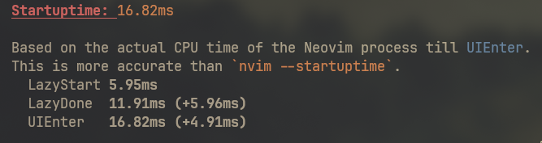
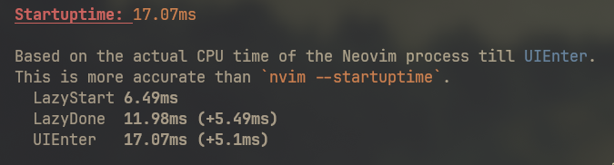
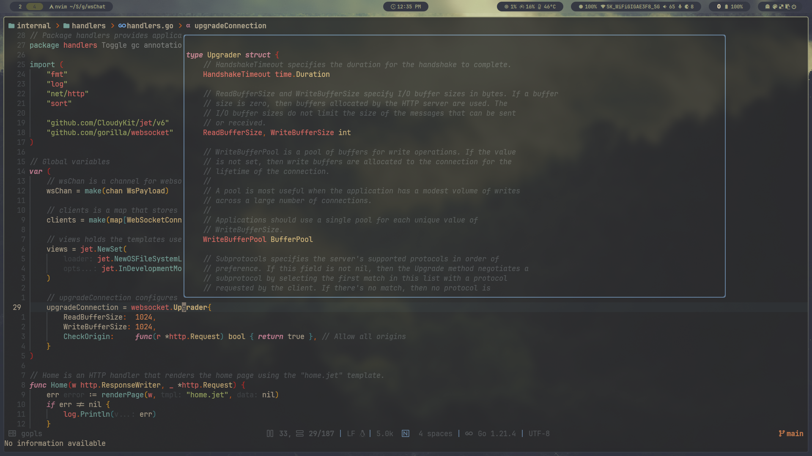

<div align="center">


<hr>

[](https://github.com/neovim/neovim)
[](https://github.com/NeViRAIDE/neviraide/issues)
<a href="https://github.com/NeViRAIDE/neviraide/commits/core/"></a>
<a href="https://github.com/NeViRAIDE/neviraide/blob/core/LICENSE"></a>
<a href="https://github.com/NeViRAIDE/neviraide/discussions"></a>

<hr>
<br>

&ensp;[<kbd> <br> Participation <br> </kbd>](#participation)&ensp;
&ensp;[<kbd> <br> Dependencies <br> </kbd>](#dependencies)&ensp;
&ensp;[<kbd> <br> Installation <br> </kbd>](#installation)&ensp;
&ensp;[<kbd> <br> Used plugins <br> </kbd>](#plugins)&ensp;
&ensp;[<kbd> <br> Todo <br> </kbd>](#todo)&ensp;
<br><br>

<hr>
<p>For Arch Linux</p>
<p><strong>Crafting an IDE Oasis in Neovim</strong></p>

https://github.com/RAprogramm/NEVIRAIDE/assets/70325462/6ccc7571-e69c-4f14-95b7-e5ac68639ca7

_*<p>"Remember, Neovim is your canvas for shaping a personalized IDE or a serene text sanctuary. Your desires and needs steer the way."</p>*_

<hr>

<h2 id='participation'>YOUR PARTICIPATION</h2>
</div>

> [!IMPORTANT]  
> Any types of participation is **absolutely voluntary**


<ul>
<li>Read <a href="./VISION.md">VISION</a> for better understanding what NEVIRAIDE will be.</li>
<li>Issues</li>

> [!TIP]
> [UI](https://github.com/RAprogramm/neviraide-ui.nvim/issues) (Everything related to display and user interface).
> 
> [Installation](https://github.com/RAprogramm/neviraide-install/issues) (Everything related to installation process).
> 
> [Neivraide functions, workings and other](https://github.com/NeViRAIDE/neviraide/issues)

<li><a href='#contributing'>Contributing</a></li>
<li><a href='https://github.com/NeViRAIDE/neviraide/discussions'>Discussions</a></li>

<li><a href='#donations'>Donations<a/></li>
</ul>
<hr>
    
<div align="center">
<h2 id='startuptime'  style="text-align: center;">STARTUP TIME</h2>
</div>

<div>

<p align="center">
  
</p>
<p align="center">
  <a href="https://github.com/RAprogramm">
     
  </a>
  <a href="https://github.com/RAprogramm">
     
  </a>
</p>

</div>
<hr>

<div align="center">
<h2 id='dependencies'  style="text-align: center;">DEPENDENCIES</h2>
</div>

<table>
    <tr>
        <th>Category</th>
        <th>Applications</th>
    </tr>
    <tr>
        <td>Core</td>
        <td><a href="https://git-scm.com/">git</a> - version control system</td>
    </tr>
    <tr>
        <td>Telescope</td>
        <td><a href="https://github.com/BurntSushi/ripgrep">rg</a> recursively searches directories for a regex pattern while respecting your gitignore</td>
    </tr>
    <tr>
        <td></td>
        <td><a href="https://github.com/sharkdp/fd">fd</a> - find alternative</td>
    </tr>
    <tr>
        <td>Mason</td>
        <td>wget</td>
    </tr>
    <tr>
        <td></td>
        <td>npm</td>
    </tr>
    <tr>
        <td></td>
        <td>curl</td>
    </tr>
    <tr>
        <td></td>
        <td>gzip</td>
    </tr>
    <tr>
        <td></td>
        <td>tar</td>
    </tr>
    <tr>
        <td></td>
        <td>unzip</td>
    </tr>
    <tr>
        <td>UI</td>
        <td>nonicons</td>
    </tr>
    <tr>
        <td></td>
        <td>nerdfonts</td>
    </tr>
</table>

[NEVIRALLER](https://github.com/NeViRAIDE/neviraller/releases/download/v1.0.0/NEVIRALLER) can check all needed dependencies and install missing, but if you want to install it manually - you can install all with one command:

```sh
yay -S git nonicons-git ripgrep fd unzip wget curl gzip tar npm
```

<h2 id='installation'  style="text-align: center;">INSTALLATION</h2>


> [!IMPORTANT]
> NEVIRALLER NOT COMPLETED NOW!
> 
> INFO ABOUT INSTALLATION YOU CAN FIND [HERE](https://github.com/NeViRAIDE/neviraide/issues/5)


<div>

1. Download [NEVIRALLER](https://github.com/RAprogramm/neviraide-install/releases/download/v1.0.0/NEVIRALLER)
2. Go to your download directory and run `chmod +x NEVIRALLER`
3. Run `./NEVIRALLER`

---

NEVIRALLER code [here](https://github.com/RAprogramm/neviraide-install).

</div>
<div align="center">
<h2 id='plugins'  style="text-align: center;">USED PLUGINS</h2>
</div>

### NeViRAIDE plugins:

- [chameleon.nvim](https://github.com/NeViRAIDE/chameleon.nvim) - colorschemes and highlightings.

### UI and Interface:

<ul>
<li>
<a href="https://github.com/nvim-lua/plenary.nvim">nvim-lua/plenary.nvim</a>: A comprehensive Lua library for Neovim.
</li>
<li>
<a href="https://github.com/MunifTanjim/nui.nvim">MunifTanjim/nui.nvim</a>: A UI library for Neovim.
</li>
    <li>
        <a href="https://github.com/RAprogramm/neviraide-ui.nvim">neviraide-ui.nvim</a>: Elevating your interface experience.
    </li>
</ul>

### Terminal and Kitty Integration:

<ul>
<li>
<a href="https://github.com/nvchad/nvterm">nvterm</a>: Seamlessly integrating the Neovim terminal.
</li>
<li>
<a href="https://github.com/RAprogramm/nekifoch">Nekifoch</a>: Harmonizing font elegance through Kitty.
</li>
</ul>

https://github.com/RAprogramm/NEVIRAIDE/assets/70325462/b78eaba6-394b-4a28-aebd-c512e4fc2763

### Icons and Visual Enhancements:

<ul>
<li>
<a href="https://github.com/nvim-tree/nvim-web-devicons">nvim-web-devicons</a>: Enhancing icon support for Neovim.
</li>
<!-- <li> -->
<!--   <a href="https://github.com/rcarriga/nvim-notify">nvim-notify</a>: A notification plugin for Neovim. -->
<!-- </li> -->
<li>
<a href="https://github.com/lukas-reineke/indent-blankline.nvim">indent-blankline.nvim</a>: Display indent guides in Neovim.
</li>
</ul>

### Completion and LSP:

<ul>
<li>
<a href="https://github.com/hrsh7th/nvim-cmp">nvim-cmp</a>: A fast completion plugin for Neovim.
</li>
<li>
<a href="https://github.com/neovim/nvim-lspconfig">nvim-lspconfig</a>: Configuration for built-in LSP client in Neovim.
</li>
<li>
<a href="https://github.com/williamboman/mason.nvim">mason.nvim</a>: Mason integration for Neovim.
</li>
<li>
<a href="https://github.com/jay-babu/mason-null-ls.nvim">mason-null-ls.nvim</a>: Mason integration for null-ls.nvim.
</li>
</ul>
<table>
<tr>

</tr>
</table>

### Syntax Highlighting and Treesitter:

<ul>
<li>
<a href="https://github.com/nvim-treesitter/nvim-treesitter">nvim-treesitter</a>: A powerful parsing tool and an abstract syntax tree (AST) generator for Neovim.
</li>
</ul>

### Debugging:

<ul>
<li><a href='https://github.com/mfussenegger/nvim-dap'>dap</a>: Debug Adapter Protocol client implementation for Neovim. nvim-dap allows you to:

- Launch an application to debug
- Attach to running applications and debug them
- Set breakpoints and step through code
- Inspect the state of the application
</li>
</ul>

### Markdown and Preview:

<ul>
<li>
<a href="https://github.com/iamcco/markdown-preview.nvim">markdown-preview.nvim</a>: A plugin for previewing Markdown files in Neovim.
</li>
</ul>

### Commenting and Code Management:

<ul>
<li>
<a href="https://github.com/numToStr/Comment.nvim">Comment.nvim</a>: A plugin for commenting code in various programming languages.
</li>
</ul>

### Git Integration:

<ul>
<li>
<a href="https://github.com/lewis6991/gitsigns.nvim">gitsigns.nvim</a>: A Git status signs plugin for Neovim.
</li>
</ul>

### TODO Comments:

<ul>
<li>
<a href="https://github.com/folke/todo-comments.nvim">todo-comments.nvim</a>: A plugin for managing TODO comments in your code.
</li>
</ul>

> [!NOTE]
> _*<p>Your Neovim journey, enriched by thoughtful choices, is a captivating exploration. Should you seek guidance or delve into the nuanced facets of your setup, our assistance is readily available. Don't hesitate to reach out!</p>*_


---

<div align="center">
<h2 id='donations'  style="text-align: center;">DONATIONS</h2>
</div>

> [!NOTE]
> If you find this helpful and would like to support its development, you can buy me a coffee through the following platforms:

<div align="center">

[](https://ko-fi.com/rozanov)

[](https://www.buymeacoffee.com/raprogramm)

**_Your support is greatly appreciated!_**

</div>
